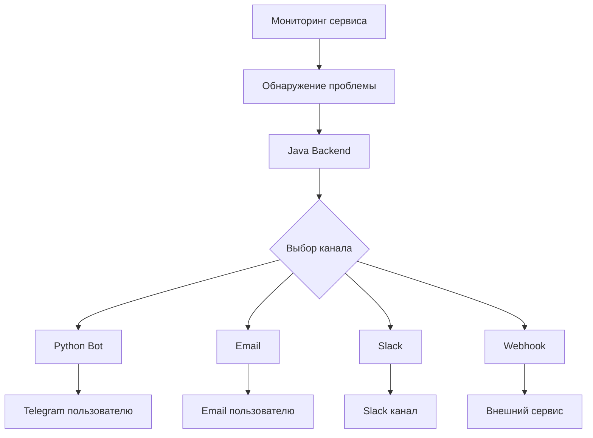

# 🏗️ Архитектура системы уведомлений

## Обзор

Система уведомлений PingTower состоит из двух основных компонентов:

1. **Python Bot** (`bot/monitoring_bot.py`) - Telegram бот для получения уведомлений
2. **Java Backend** - REST API для отправки уведомлений

## Компоненты системы

### 1. Python Bot (Telegram)

**Расположение**: `bot/monitoring_bot.py`

**Функции**:
- Прием и обработка уведомлений от Java бэкенда
- Управление пользователями Telegram
- Отправка уведомлений в Telegram
- Хранение пользовательских данных в SQLite

**API эндпоинты**:
- `POST /send_notification` - отправка уведомления
- `GET /health` - проверка здоровья бота
- `POST /register` - регистрация пользователя
- `GET /users` - список пользователей

### 2. Java Backend

**Расположение**: `backend/src/main/java/`

**Функции**:
- REST API для управления уведомлениями
- Интеграция с Python ботом
- Управление каналами уведомлений
- Отправка уведомлений через различные каналы

**API эндпоинты**:
- `POST /notifications/send` - отправка уведомления
- `GET /notifications/channels` - список каналов
- `POST /notifications/channels` - создание канала
- `GET /notifications/deliveries` - история доставки

## Поток данных



## Типы каналов уведомлений

### 1. Python Bot (PYTHON_BOT)
- **Описание**: Интеграция с Python Telegram ботом
- **Конфигурация**: URL бота
- **Использование**: Основной канал для Telegram уведомлений

### 2. Telegram (TELEGRAM)
- **Описание**: Прямая интеграция с Telegram Bot API
- **Конфигурация**: Bot Token, Chat ID
- **Использование**: Альтернативный способ отправки в Telegram

### 3. Email (EMAIL)
- **Описание**: Отправка email уведомлений
- **Конфигурация**: SMTP настройки
- **Использование**: Email уведомления

### 4. Slack (SLACK)
- **Описание**: Интеграция со Slack
- **Конфигурация**: Webhook URL
- **Использование**: Уведомления в Slack каналы

### 5. Webhook (WEBHOOK)
- **Описание**: HTTP webhook уведомления
- **Конфигурация**: URL, заголовки
- **Использование**: Интеграция с внешними системами

## База данных

### Python Bot (SQLite)
**Файл**: `bot/monitoring_bot.db`

**Таблицы**:
- `users` - пользователи Telegram
- `notifications` - история уведомлений

### Java Backend (PostgreSQL)
**Таблицы**:
- `notification_channels` - каналы уведомлений
- `notification_deliveries` - история доставки
- `alerts` - алерты системы

## Конфигурация

### Python Bot
**Файл**: `.env`

```env
TELEGRAM_BOT_TOKEN=your_bot_token_here
DATABASE_URL=sqlite:///monitoring_bot.db
BOT_URL=http://localhost:5000
```

### Java Backend
**Файл**: `application.yaml`

```yaml
notifications:
  python-bot:
    url: http://localhost:5000
  channels:
    default-type: PYTHON_BOT
```

## Безопасность

### Аутентификация
- **Python Bot**: Регистрация пользователей через Telegram
- **Java Backend**: JWT токены для API доступа

### Валидация
- Все входящие данные проверяются
- SQL инъекции предотвращены через параметризованные запросы
- XSS защита через экранирование

### Логирование
- Все операции логируются
- Аудит доступа к API
- Мониторинг ошибок доставки

## Масштабируемость

### Горизонтальное масштабирование
- Python бот может быть запущен в нескольких экземплярах
- Java Backend поддерживает кластеризацию
- База данных может быть реплицирована

### Производительность
- Асинхронная обработка уведомлений
- Кэширование каналов уведомлений
- Batch отправка для множественных уведомлений

## Мониторинг

### Метрики
- Количество отправленных уведомлений
- Время доставки
- Процент успешной доставки
- Ошибки доставки

### Алерты
- Недоступность Python бота
- Ошибки доставки уведомлений
- Превышение лимитов отправки

## Развертывание

### Docker
```yaml
# docker-compose.yml
version: '3.8'
services:
  python-bot:
    build: ./bot
    ports:
      - "5000:5000"
    environment:
      - TELEGRAM_BOT_TOKEN=${TELEGRAM_BOT_TOKEN}
  
  java-backend:
    build: ./backend
    ports:
      - "8080:8080"
    depends_on:
      - python-bot
```

### Kubernetes
```yaml
apiVersion: apps/v1
kind: Deployment
metadata:
  name: python-bot
spec:
  replicas: 2
  selector:
    matchLabels:
      app: python-bot
  template:
    metadata:
      labels:
        app: python-bot
    spec:
      containers:
      - name: python-bot
        image: pingtower/python-bot:latest
        ports:
        - containerPort: 5000
```

## Интеграция с внешними системами

### Webhook интеграции
- Slack
- Discord
- Microsoft Teams
- Custom webhooks

### API интеграции
- Telegram Bot API
- SMTP серверы
- HTTP APIs

### Мониторинг систем
- Prometheus метрики
- Grafana дашборды
- ELK Stack логирование
